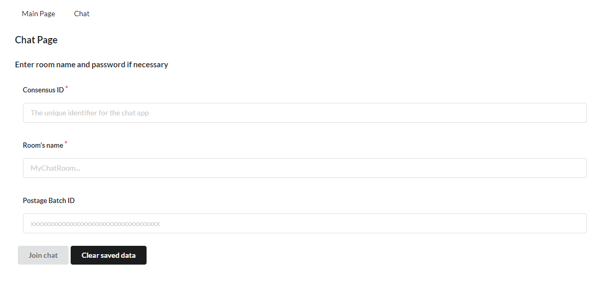
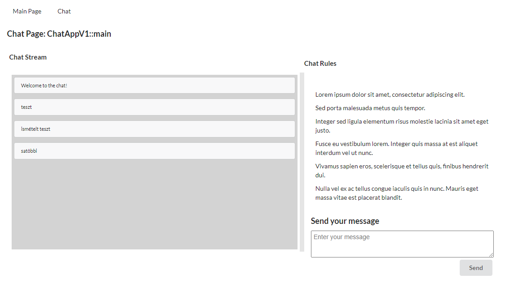

# Getting Started with Feed chat webapp

## Start program

The program requires bee 1.16 dev mode or a functioning swarm node<br/> 
(only on bee 1.16.1 has been tested in dev mode at the moment).

Requirements:
- nodejs
- bee 1.16 dev mode or a functioning swarm node
- postage stamp to the swarm network

In the feed-chat-webapp directory, run: ```npm start```

after the program has started, open your browser and go to: ```http://localhost:3000```

## How to use
Click on chat menu item to navigate to the chat settings before join. <br/>

Fields:
- Consensus ID: the consensus ID of the chat App
- Room's name: this is the topic itself, this and the Consent ID are used together to identify the chat room
- Postage Batch ID: the postage stamp ID you bought previously to write to the network

There are two buttons at the bottom of the page, one to join the chat and one to clear local history of chats and messages (all). <br/>
At the moment if a room (Consensus ID+Room's name) does not exist, the program will create it, so make sure you type those details correctly. <br/>



The join screen will remember your last typed details to make easier to rejoin to the same chat room. <br/>

After you joined to the chat room, you can start chatting as soon as the script finds or create the feed to the details. <br/>



The downloaded messages will be stored in local storage until cleared, and not downloading again except if you delete the messages from local storage. <br/>